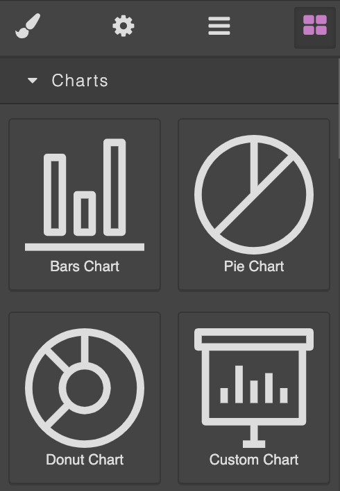
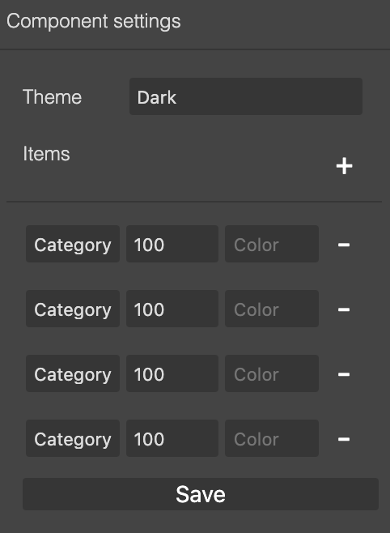
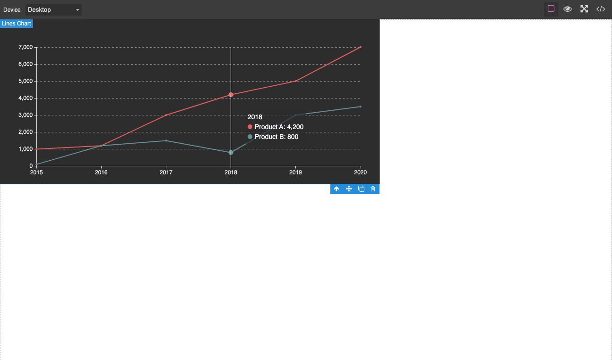
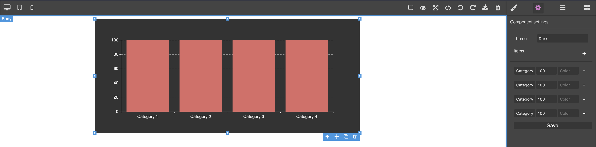
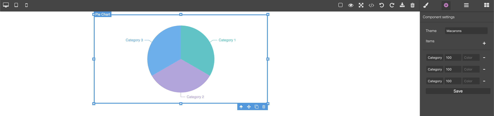

# Grapesjs Echarts

[](https://travis-ci.org/jvas28/grapesjs-echarts)

This is a **WORK IN PROGRESS** version of adding :chart_with_upwards_trend: chart components to [GrapesJS](https://grapesjs.com/docs/api/component.html) using [Echarts](https://www.echartsjs.com/) library.

Give it a try in
[Code Pen](https://codepen.io/jvas28/pen/ZEGByOq).

Check a basic result [here](https://codepen.io/jvas28/pen/qBdRWBp).

## Available Components :bar_chart:

Currently there are only 4 chart components.

- `Bars Chart`
- `Pie Chart`
- `Donut Chart`
- `Lines Chart`

And a special one, the `Custom Chart` which will allow you to create any type of chart by adding `echarts.options` in JSON string format while I keep bringing more `Chart Components` and `Settings`.

<p align="center">

</p>

## Available Settings

- Theme
- Items
  - Name
  - Value
  - Color

<p align="center">

</p>

This settings are available for all components but `Custom Chart`.

## I18n Support

If you want to customize some strings used in this app you can use pluginOpts to pass a set of translations or if you just want to change the language you can pass your prefered local (Between english and spanish for now ), I'm open to PRs for other languages, still small plugin so not that much to translate. :wink:

```
...
pluginsOpts: {
          "grapesjs-echarts": {
            intl: {
              locale: "en", // "es" also available
              messages: {
                en: {
                  components: {
                    bars: { name: "My new bars name" },
                  },
                },
              },
            },
          },
        },
...
```

Reference [locale](https://github.com/jvas28/grapesjs-echarts/tree/master/src/locale) folder to get the idea of the structure for labels.

## Usage

Directly in the browser

```html
<link
  href="https://unpkg.com/grapesjs/dist/css/grapes.min.css"
  rel="stylesheet"
/>
<script src="https://unpkg.com/grapesjs"></script>
<script src="https://unpkg.com/grapesjs-echarts.min.js"></script>

<div id="gjs"></div>

<script type="text/javascript">
  var editor = grapesjs.init({
    container: "#gjs",
    // ...
    plugins: ["grapesjs-echarts"],
    pluginsOpts: {
      "grapesjs-echarts": {
        /* options */
      },
    },
  });
</script>
```

Modern javascript

```js
import grapesjs from 'grapesjs';
import plugin from 'grapesjs-echarts';
import 'grapesjs/dist/css/grapes.min.css';

const editor = grapesjs.init({
  container : '#gjs',
  // ...
  plugins: [plugin],
  pluginsOpts: {
    [plugin]: { /* options */ }
  }
  // or
  plugins: [
    editor => plugin(editor, { /* options */ }),
  ],
});
```

## Development

Clone the repository

```sh
$ git clone https://github.com/jvas28/grapesjs-echarts.git
$ cd grapesjs-echarts
```

Install dependencies

```sh
$ npm i
```

Start the dev server

```sh
$ npm start
```

Build the source

```sh
$ npm run build
```

## Credits

### Icons

Designed by [Smartline](https://www.flaticon.com/authors/smartline) from [www.flaticon.com](www.flaticon.com)

## Roadmap V1

- [x] Basic Bars Chart
- [x] Basic Pie Chart
- [x] Basic Donut Chart
- [x] Basic Lines Chart
- [ ] Tooltip trait
- [ ] Toolbox trait
- [ ] Legend trait
- [ ] Grid trait

## Screenshots






## License

MIT
