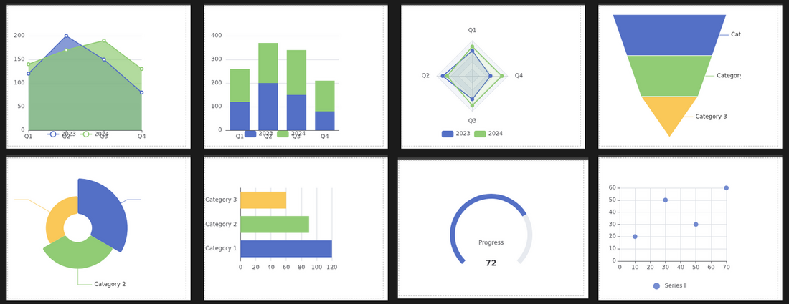

# Grapesjs Echarts

Adds :chart_with_upwards_trend: chart components to [GrapesJS](https://grapesjs.com/docs/api/component.html) using the [ECharts](https://www.echartsjs.com/) library — 12 chart types, live-editable from the canvas.

As of `v1.0.0` this is a stable release: rebuilt on the current GrapesJS and ECharts APIs (see [Requirements](#requirements) below), with a modern build pipeline and a much larger set of chart types than earlier `0.0.x` releases.

> The old [Code Pen](https://codepen.io/jvas28/pen/ZEGByOq) / [basic result](https://codepen.io/jvas28/pen/qBdRWBp) demos were built against a `0.0.x` release and are out of date — follow [Usage](#usage) below for the current setup instead.

See [CHANGELOG.md](CHANGELOG.md) for what's new, and [Migrating from 0.0.x](#migrating-from-00x) if you're upgrading.

## Available Components :bar_chart:

- `Bars Chart`
- `Horizontal Bar Chart`
- `Stacked Bar Chart`
- `Lines Chart`
- `Area Chart`
- `Pie Chart`
- `Donut Chart`
- `Rose Chart`
- `Radar Chart`
- `Funnel Chart`
- `Gauge Chart`
- `Scatter Chart`

And a special one, the `Custom Chart` which will allow you to create any type of chart by adding `echarts.options` in JSON string format.

<p align="center">

</p>

## Available Settings

- Theme — the full set of [ECharts built-in themes](https://echarts.apache.org/en/download-theme.html), loaded on demand
- Items — automatically applied as you edit, no explicit save step
  - Name
  - Value (or, for Scatter, X/Y points)
  - Color — native color picker, defaults to an auto-assigned palette
- Min / Max — `Gauge Chart` only

<p align="center">

</p>

These settings are available for all components but `Custom Chart`.

## I18n Support

If you want to customize some strings used in this app you can use pluginOpts to pass a set of translations or if you just want to change the language you can pass your prefered local (Between english and spanish for now ), I'm open to PRs for other languages, still small plugin so not that much to translate. :wink:

```
...
pluginsOpts: {
          "grapesjs-echarts": {
            intl: {
              locale: "en", // "es" also available
              messages: {
                en: {
                  components: {
                    bars: { name: "My new bars name" },
                  },
                },
              },
            },
          },
        },
...
```

Reference [locale](https://github.com/jvas28/grapesjs-echarts/tree/master/src/locale) folder to get the idea of the structure for labels.

## Requirements

This plugin does not bundle `grapesjs` or `echarts` &mdash; both are peer
dependencies, so your app supplies a single shared copy of each (this also
avoids the "two different echarts instances" errors some bundlers, like
Vite, would otherwise throw). Supported versions:

- `grapesjs` >= 0.19
- `echarts` ^5 or ^6

## Migrating from 0.0.x

`v1.0.0` is a breaking change if you're coming from a `0.0.x` release:

1. **Install `echarts` yourself.** It used to be bundled into this plugin; now it's a peer dependency (see [Requirements](#requirements) above), so `npm install echarts` (or add the `<script src="https://unpkg.com/echarts@6">` tag — see [Usage](#usage) below) in your own app. This is also what fixes the "two different echarts instances" crash some bundlers (Vite in particular) used to throw.
2. **Nothing else changes in how you call the plugin** — `grapesjs.init({ plugins: ["grapesjs-echarts"], ... })` and `pluginsOpts` work exactly as before. Component/trait/block names, the `intl` options, and the theme names are all unchanged.
3. If you saved projects with `storageManager` under `0.0.x`, they'll load fine — the stored `data-ecg-*` attributes didn't change shape.

## Usage

Directly in the browser

```html
<link
  href="https://unpkg.com/grapesjs/dist/css/grapes.min.css"
  rel="stylesheet"
/>
<script src="https://unpkg.com/grapesjs"></script>
<script src="https://unpkg.com/echarts@6"></script>
<script src="https://unpkg.com/grapesjs-echarts.min.js"></script>

<div id="gjs"></div>

<script type="text/javascript">
  var editor = grapesjs.init({
    container: "#gjs",
    // ...
    plugins: ["grapesjs-echarts"],
    pluginsOpts: {
      "grapesjs-echarts": {
        /* options */
      },
    },
  });
</script>
```

Modern javascript

```js
import grapesjs from 'grapesjs';
import plugin from 'grapesjs-echarts';
import 'grapesjs/dist/css/grapes.min.css';
// echarts must be installed (it's a peer dependency), no import needed here

const editor = grapesjs.init({
  container : '#gjs',
  // ...
  plugins: [plugin],
  pluginsOpts: {
    [plugin]: { /* options */ }
  }
  // or
  plugins: [
    editor => plugin(editor, { /* options */ }),
  ],
});
```

## Development

Clone the repository

```sh
$ git clone https://github.com/jvas28/grapesjs-echarts.git
$ cd grapesjs-echarts
```

Install dependencies

```sh
$ npm i
```

Start the dev server

```sh
$ npm start
```

Build the source

```sh
$ npm run build
```

## Credits

### Icons

The original Bars, Pie, Donut and Custom chart icons were designed by [Smartline](https://www.flaticon.com/authors/smartline) from [www.flaticon.com](www.flaticon.com). The icons for the newer chart types are simple hand-drawn SVGs.

## Roadmap

`v1.0.0`:

- [x] Basic Bars, Pie, Donut and Lines charts
- [x] Area, Stacked Bar, Horizontal Bar, Rose, Radar, Funnel, Gauge and Scatter charts
- [x] Live preview while editing (no more explicit Save step)
- [x] Color picker for items
- [x] Rebuilt on current GrapesJS / ECharts APIs

Next:

- [ ] Tooltip trait
- [ ] Toolbox trait
- [ ] Legend trait
- [ ] Grid trait

## Screenshots

### New in this version



### Original charts


## License

MIT
