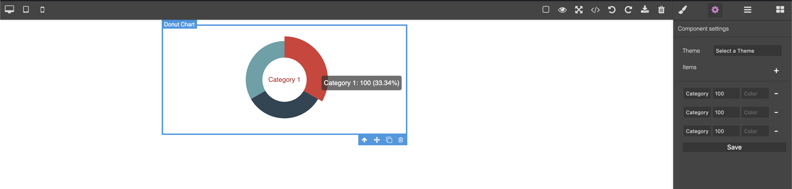

# Grapesjs Echarts

[](https://travis-ci.org/jvas28/grapesjs-echarts)

This is a **WORK IN PROGRESS** version of adding chart components to [GrapesJS](https://grapesjs.com/docs/api/component.html) using [Echarts](https://www.echartsjs.com/) library. 

Give it a try in
[Code Pen](https://codepen.io/jvas28/pen/ZEGByOq).

Check a basic result [here](https://codepen.io/jvas28/pen/ZEGByOq).


## Available Components
Currently there are only 4 components.
- Bars
- Pie
- Donut
- Custom
<p align="center">

</p>


### Custom Component


## Usage

Directly in the browser
```html
<link href="https://unpkg.com/grapesjs/dist/css/grapes.min.css" rel="stylesheet"/>
<script src="https://unpkg.com/grapesjs"></script>
<script src="https://unpkg.com/grapesjs-echarts.min.js"></script>

<div id="gjs"></div>

<script type="text/javascript">
  var editor = grapesjs.init({
      container: '#gjs',
      // ...
      plugins: ['grapesjs-echarts'],
      pluginsOpts: {
        'grapesjs-echarts': { /* options */ }
      }
  });
</script>
```

Modern javascript
```js
import grapesjs from 'grapesjs';
import plugin from 'grapesjs-echarts';
import 'grapesjs/dist/css/grapes.min.css';

const editor = grapesjs.init({
  container : '#gjs',
  // ...
  plugins: [plugin],
  pluginsOpts: {
    [plugin]: { /* options */ }
  }
  // or
  plugins: [
    editor => plugin(editor, { /* options */ }),
  ],
});
```


## Development

Clone the repository

```sh
$ git clone https://github.com/jvas28/grapesjs-echarts.git
$ cd grapesjs-echarts
```

Install dependencies

```sh
$ npm i
```

Start the dev server

```sh
$ npm start
```

Build the source

```sh
$ npm run build
```

## Credits

### Icons
Designed by [Smartline](https://www.flaticon.com/authors/smartline) from [www.flaticon.com](www.flaticon.com)

## Screenshots





## License

MIT
